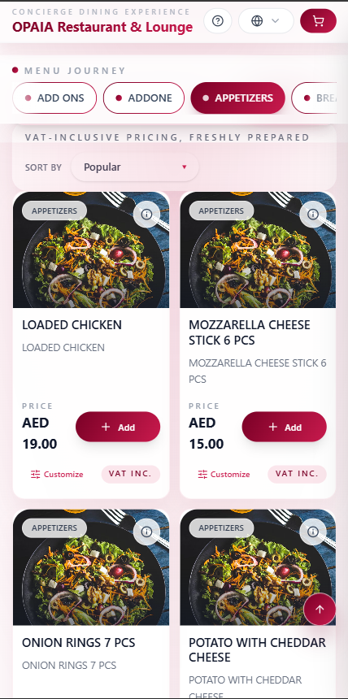
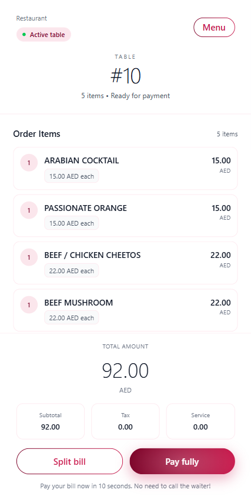
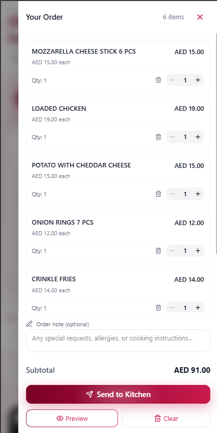

# 🍽️ QR Menu - Digital Restaurant Menu & Payment System

<div align="center">


**A modern, contactless QR code-based menu and payment system for restaurants**

[Features](#-features) • [Installation](#-installation) • [Usage](#-usage) • [API Documentation](#-api-documentation) • [Contributing](#-contributing)

</div>

---

## 📋 Table of Contents

- [Overview](#-overview)
- [Features](#-features)
- [Tech Stack](#-tech-stack)
- [Project Structure](#-project-structure)
- [Installation](#-installation)
- [Configuration](#-configuration)
- [Usage](#-usage)
- [API Documentation](#-api-documentation)
- [Payment Integration](#-payment-integration)
- [Screenshots](#-screenshots)
- [Contributing](#-contributing)
- [License](#-license)

---

## 🎯 Overview

QR Menu is a comprehensive digital menu and payment solution that allows restaurant customers to:
- 📱 Scan QR codes to access digital menus
- 🛒 Browse items, add to cart, and customize orders
- 💳 Make secure payments directly from their table
- 🔄 Navigate seamlessly between menu and payment without re-scanning
- 🌍 Support for multiple languages (English & Arabic)

Perfect for restaurants looking to provide a contactless dining experience with integrated payment processing.

---

## ✨ Features

### 🍕 Menu Features
- **Digital Menu Display** - Beautiful, responsive menu with categories
- **Search Functionality** - Quick search across menu items
- **Item Customization** - Add modifiers and extras to items
- **Real-time Cart** - Add/remove items with live updates
- **Multi-language Support** - English and Arabic interface
- **Image Gallery** - High-quality product images

### 💰 Payment Features
- **Multiple Payment Methods** - Card payments via Telr gateway
- **Split Bill Options**:
  - Pay Full Amount
  - Equal Split (divide equally among people)
  - Item Split (pay for specific items)
  - Custom Amount Split
- **Payment Status Tracking** - Real-time payment status updates
- **Order History** - View ongoing and completed orders

### 🎨 User Experience
- **Seamless Navigation** - Switch between menu and payment without re-scanning
- **Table Management** - Automatic table identification via QR codes
- **Responsive Design** - Works perfectly on mobile, tablet, and desktop
- **Modern UI/UX** - Beautiful gradient design with smooth animations
- **Accessibility** - Screen reader friendly and keyboard navigation

### 🏢 Restaurant Features
- **Floor Plan Management** - Visual table layout planning
- **Table Reservation** - Integrated reservation system
- **Order Management** - Track orders by table
- **KOT (Kitchen Order Ticket)** - Automatic order generation

---

## 🛠️ Tech Stack

### Frontend
- **React 19.1.1** - Modern UI library
- **Vite** - Fast build tool and dev server
- **React Router** - Client-side routing
- **Zustand** - Lightweight state management
- **Tailwind CSS 4.1** - Utility-first CSS framework
- **Axios** - HTTP client
- **i18next** - Internationalization
- **Lucide React** - Beautiful icons
- **Lottie React** - Animations

### Backend
- **Node.js** - Runtime environment
- **Express 5.1** - Web framework
- **MSSQL** - Database connectivity
- **QRCode** - QR code generation
- **CORS** - Cross-origin resource sharing
- **Express Rate Limit** - API rate limiting
- **Node Cache** - In-memory caching

### Payment Gateway
- **Telr** - Payment processing integration

---

## 📁 Project Structure

```
qrMenu/
├── frontend/                 # React frontend application
│   ├── src/
│   │   ├── component/       # React components
│   │   │   ├── CartDrawer.jsx
│   │   │   ├── ItemCard.jsx
│   │   │   ├── MenuGrid.jsx
│   │   │   ├── PaymentSuccess.jsx
│   │   │   └── ...
│   │   ├── pages/           # Page components
│   │   │   ├── MenuPage.jsx
│   │   │   ├── TableSummary.jsx
│   │   │   ├── ReservePage.jsx
│   │   │   └── ...
│   │   ├── services/         # API services
│   │   │   ├── menu.service.js
│   │   │   ├── payment.service.js
│   │   │   └── ...
│   │   ├── store/           # State management
│   │   │   ├── cartStore.js
│   │   │   └── uiStore.js
│   │   ├── assets/          # Images, animations
│   │   ├── i18n/            # Translations
│   │   └── utils/           # Utility functions
│   ├── public/              # Static assets
│   ├── package.json
│   └── vite.config.js
│
├── backend/                 # Node.js backend API
│   ├── config/              # Configuration files
│   │   └── dbConfig.js
│   ├── controllers/         # Route controllers
│   │   ├── menu.controller.js
│   │   ├── payment.controller.js
│   │   └── ...
│   ├── routes/              # API routes
│   │   ├── menu.routes.js
│   │   ├── payment.routes.js
│   │   └── table.routes.js
│   ├── services/            # Business logic
│   │   ├── menu.service.js
│   │   ├── payment.service.js
│   │   └── ...
│   ├── utils/               # Utilities
│   │   ├── qr.utils.js
│   │   └── pagination.js
│   ├── scripts/              # Helper scripts
│   │   └── gen-qr-103.js    # QR code generator
│   ├── index.js             # Entry point
│   └── package.json
│
├── .gitignore
└── README.md
```

---

## 🚀 Installation

### Prerequisites

- **Node.js** (v18 or higher)
- **npm** or **yarn**
- **SQL Server** database
- **Git**

### Step 1: Clone the Repository

```bash
git clone https://github.com/YOUR_USERNAME/qrMenu.git
cd qrMenu
```

### Step 2: Install Frontend Dependencies

```bash
cd frontend
npm install
```

### Step 3: Install Backend Dependencies

```bash
cd ../backend
npm install
```

---

## ⚙️ Configuration

### Backend Configuration

1. Create a `.env` file in the `backend/` directory:

```env
# Database Configuration
DB_SERVER=your_server_name
DB_DATABASE=your_database_name
DB_USER=your_username
DB_PASSWORD=your_password
DB_PORT=1433

# Server Configuration
PORT=3000
NODE_ENV=development

# Frontend URL (for CORS)
FRONTEND_URL=http://localhost:5173

# Telr Payment Gateway
TELR_STORE_ID=your_store_id
TELR_AUTH_KEY=your_auth_key
TELR_API_URL=https://secure.telr.com/gateway/order.json
```

### Frontend Configuration

1. Update API base URL in `frontend/src/lib/api.js`:

```javascript
const API_BASE_URL = 'http://localhost:3000/api';
```

---

## 🎮 Usage

### Development Mode

#### Start Backend Server

```bash
cd backend
npm run dev
```

The backend will run on `http://localhost:3000`

#### Start Frontend Development Server

```bash
cd frontend
npm run dev
```

The frontend will run on `http://localhost:5173`

### Production Build

#### Build Frontend

```bash
cd frontend
npm run build
```

#### Start Production Server

```bash
cd backend
npm start
```

### Generate QR Codes

Generate QR codes for tables:

```bash
cd backend
npm run gen:qr [tableId] [area]
```

Example:
```bash
npm run gen:qr 10 DININ
```

This generates a QR code image for table 10 in the dining area.

---

## 📡 API Documentation

### Menu Endpoints

#### Get Categories
```http
GET /api/menu/categories
```

#### Get Menu Items
```http
GET /api/menu/items?page=1&pageSize=24&search=&groupId=
```

**Query Parameters:**
- `page` - Page number (default: 1)
- `pageSize` - Items per page (default: 24)
- `search` - Search query
- `groupId` - Filter by category ID

#### Get Modifiers
```http
GET /api/modifiers/:productId
```

### Table Endpoints

#### Resolve Table Token
```http
POST /api/r/resolve
Content-Type: application/json

{
  "token": "table_token_here"
}
```

**Response:**
```json
{
  "ok": true,
  "tableId": "10",
  "area": "DININ",
  "lines": [...]
}
```

### Payment Endpoints

#### Get Payment Methods
```http
GET /api/payment/methods
```

#### Get Table Balance
```http
GET /api/payment/balance/:tableId?kotMasterID=
```

#### Process Payment
```http
POST /api/payment/pay-full
Content-Type: application/json

{
  "billAmount": 150.00,
  "tableId": "10",
  "kotMasterID": 123
}
```

#### Split Payment Options
- **Equal Split**: `POST /api/payment/equal-split`
- **Custom Split**: `POST /api/payment/custom-split`
- **Item Split**: `POST /api/payment/item-split`

### Order Endpoints

#### Save Order (KOT)
```http
POST /api/kot/save
Content-Type: application/json

{
  "header": {
    "tableId": "10",
    "chairNo": 1,
    "note": "Extra spicy"
  },
  "items": [...]
}
```

---

## 💳 Payment Integration

### Telr Payment Gateway

The application integrates with Telr payment gateway for secure card payments.

**Features:**
- Secure payment processing
- Multiple payment methods (Card, Apple Pay, Google Pay, Samsung Pay)
- Payment status tracking
- Transaction history

**Payment Flow:**
1. Customer selects payment method
2. Redirects to Telr payment page
3. Customer completes payment
4. Returns to application with payment status
5. Order is updated with payment information

---

## 📸 Screenshots

> **Note:** Add screenshots of your application here. You can add them to a `screenshots/` folder and reference them like this:

```



```

---

## 🤝 Contributing

Contributions are welcome! Please follow these steps:

1. **Fork the repository**
2. **Create a feature branch**
   ```bash
   git checkout -b feature/amazing-feature
   ```
3. **Commit your changes**
   ```bash
   git commit -m 'Add some amazing feature'
   ```
4. **Push to the branch**
   ```bash
   git push origin feature/amazing-feature
   ```
5. **Open a Pull Request**

### Coding Standards

- Follow ESLint configuration
- Write meaningful commit messages
- Add comments for complex logic
- Update documentation for new features

---

## 📝 License

This project is licensed under the **ISC License**.

---

## 👥 Authors

- **Sabeeh** - [YourGitHub](https://github.com/Sabeeh098)

---

## 🙏 Acknowledgments

- React team for the amazing framework
- Tailwind CSS for the utility-first CSS framework
- Telr for payment gateway integration
- All contributors and users of this project

---

## 📞 Support

For support, email your-email@example.com or open an issue in the repository.

---

## 🔮 Roadmap

- [ ] Add more payment gateways
- [ ] Implement order tracking
- [ ] Add admin dashboard
- [ ] Multi-restaurant support
- [ ] Analytics and reporting
- [ ] Mobile app (React Native)

---

<div align="center">

**Made with ❤️ for restaurants**

⭐ Star this repo if you find it helpful!

</div>

